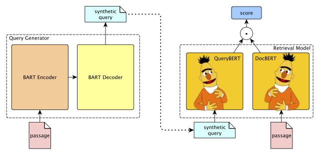

# Neural Retrieval
[](LICENSE)


Embedding-based Zero-shot Retrieval through Query Generation leverages query synthesis over large corpuses of unlabeled text (such as Wikipedia) to pre-train siamese neural retrieval models. The resulting models significantly improve over previous BM25 baselines as well as state-of-the-art neural methods.

This package provides support for leveraging BART-large for query synthesis as well as code for training and finetuning a transformer based neural retriever.
We also provide pre-generated synthetic queries on Wikipedia, and relevant pre-trained models that are obtainable through our download scripts.

<p align=center></p>

**Paper:** Davis Liang\*, Peng Xu\*, Siamak Shakeri, Cicero Nogueira dos Santos, Ramesh Nallapati, Zhiheng Huang, Bing Xiang, [Embedding-based Zero-shot Retrieval through Query Generation](https://arxiv.org/pdf/2009.10270.pdf), 2020.

## Getting Started
#### dependencies:
`pip install torch torchvision transformers tqdm
`
#### running setup
`python setup.py install --user
`

| Package       | Version       | 
| ------------- |:-------------:|
| torch         | \>=1.6.0         |
| transformers  | \>=3.0.2         |
| tqdm          | 4.43.0        |

### WikiGQ dataset and Pretrained Neural Retrieval Model
- **WikiGQ**: We process the Wikipedia 2016 dump and split it into passages of maximum length 100 with respecting the sentence boundaries. We synthesis over 100M synthetic queries using BART-large models. 
The split passages and synthetic queries files can be downloaded from [here](https://repo.gluon.ai/gluon/dataset/WikiGQ/WikiGQ.zip). 
- **Siamese-BERT-base-model**: We release our siamese-bert-base-model trained on `WikiGQ` dataset. The model files can be downloaded from [here](https://repo.gluon.ai/gluon/models/siamese-bert-base-uncased-2ef0f73e8.zip).     


## Training and Evaluation

### Example: Natural Questions (NQ)

Here we take an example on Natural Questions data. Please download the [simplified version of the training set](https://storage.cloud.google.com/natural_questions/v1.0-simplified/simplified-nq-train.jsonl.gz) and also use supplied `simplify_nq_example` function
in [simplify_nq_data.py](https://github.com/google-research-datasets/natural-questions/blob/master/simplify_nq_data.py) to create the simplified dev set as well.

#### process the data
We provide the python script to convert the data into the format our model consumes.
```
NQ_DIR=YOUR PATH TO SIMPLIFIED NQ TRAIN AND DEV FILES
python data_processsing/nq_preprocess.py \
--trainfile $NQ_DIR/v1.0-simplified-train.jsonl.gz \
--devfile $NQ_DIR/v1.0-simplified-dev.jsonl.gz \
--passagefile $NQ_DIR/all_passages.jsonl \
--queries_trainfile $NQ_DIR/train_queries.json \
--answers_trainfile $NQ_DIR/train_anwers.json \
--queries_devfile $NQ_DIR/dev_queries.json \
--answers_devfile $NQ_DIR/dev_answers.json \
--qrelsfile $NQ_DIR/all_qrels.txt
```
#### training

```angular2html
OUTPUT_DIR=./output
mkdir -p $OUTPUT_DIR
python examples/neural_retrieval.py \
--query_len 64 \
--passage_len 288 \
--epochs 10 \
--sample_size 0 \
--batch_size 50 \
--embed_size 128 \
--print_iter 200 \
--eval_iter 0 \
--passagefile $NQ_DIR/all_passages.jsonl \
--train_queryfile $NQ_DIR/train_queries.json \
--train_answerfile $NQ_DIR/train_answers.json \
--save_model $OUTPUT_DIR/siamese_model.pt \
--share \
--gpu \
--num_nodes 1 \
--num_gpus 1 \
--train 
```
This will generate two model files in the `OUTPUT_DIR`: `siamese_model.pt.doc` and `siamese_model.pt.query`. They are exactly the same if your add `--share` during training. 
#### Inference

- Passage Embedding
```angular2html
python examples/neural_retrieval.py \
--query_len 64 \
--passage_len 288 \
--embed_size 128 \
--passagefile $NQ_DIR/all_passages.jsonl \
--gpu \
--num_nodes 1 \
--num_gpus 1 \
--local_rank 0 \
--doc_embed \
--doc_embed_file $OUTPUT_DIR/psg_embeds.csv \
--save_model $OUTPUT_DIR/siamese_model.pt 
```
- Running Retrieval 
```angular2html
python examples/neural_retrieval.py \
--query_len 64 \
--passage_len 288 \
--batch_size 100 \
--embed_size 128 \
--test_queryfile $NQ_DIR/dev_queries.json \
--gpu \
--num_nodes 1 \
--num_gpus 1 \
--local_rank 0 \
--topk 100 \
--query_embed \
--query_embed_file $OUTPUT_DIR/dev_query_embeds.csv \
--generate_retrieval \
--doc_embed_file $OUTPUT_DIR/psg_embeds.csv \
--save_model $OUTPUT_DIR/siamese_model.pt  \
--retrieval_outputfile $OUTPUT_DIR/dev_results.json
```
- Evaluation

We use [trec_eval](https://github.com/usnistgov/trec_eval) to do the evaluation. 
```angular2html
trec_eval $NQ_DIR/all_qrels.txt $OUTPUT_DIR/dev_results.json.txt -m recall 
```

### BART Model for Query Generation
- Download the BART-large model files from Huggingface model hub [here](https://s3.amazonaws.com/models.huggingface.co/bert/facebook/bart-large/pytorch_model.bin).
- Download the MSMARCO-PR dataset files from the official website: [collection.tsv](https://msmarco.blob.core.windows.net/msmarcoranking/collection.tar.gz), 
[queries.train.tsv, queries.dev.tsv](https://msmarco.blob.core.windows.net/msmarcoranking/queries.tar.gz), 
[qrels.train.tsv](https://msmarco.blob.core.windows.net/msmarcoranking/qrels.train.tsv), 
[qrels.dev.tsv](https://msmarco.blob.core.windows.net/msmarcoranking/qrels.dev.tsv). 

#### Finetune BART-QG Model on MSMARCO-PR dataset
```angular2html
MSMARCO_PATH=YOUR PATH TO MSMARCO FILES
QG_MODEL_OUTPUT=./qg_model_output
mkdir -p $QG_MODEL_OUTPUT
CUDA_VISIBLE_DEVICES=0,1,2,3 python examples/bart_qg.py \
--corpusfile $MSMARCO_PATH/collection.tsv \
--train_queryfile $MSMARCO_PATH/queries.train.tsv \
--train_qrelfile $MSMARCO_PATH/qrels.train.tsv \
--valid_queryfile $MSMARCO_PATH/queries.dev.tsv \
--valid_qrelfile $MSMARCO_PATH/qrels.dev.tsv \
--max_input_len 300 \
--max_output_len 100 \
--epochs 5 \
--lr 3e-5 \
--warmup 0.1 \
--wd 1e-3 \
--batch_size 24 \
--print_iter 100 \
--eval_iter 5000 \
--log ms_log \
--save_model $QG_MODEL_OUTPUT/best_qg.pt \
--gpu
```
#### Generate Synthetic Queries
As an example, we generate synthetic queries on NQ passages. 
```angular2html
QG_OUTPUT_DIR=./qg_output
mkdir -p $QG_OUTPUT_DIR
python examples/bart_qg.py \
--test_corpusfile $QG_OUTPUT_DIR/all_passages.jsonl \
--test_outputfile $QG_OUTPUT_DIR/generated_questions.txt \
--generated_queriesfile $QG_OUTPUT_DIR/syn_queries.json \
--generated_answersfile $QG_OUTPUT_DIR/syn_answers.json \
--model_path $QG_MODEL_OUTPUT/best_qg_ms.pt \
--test \
--num_beams 5 \
--do_sample \
--num_samples 10 \
--top_p 0.95 \
--gpu
```


## Security

See [CONTRIBUTING](CONTRIBUTING.md#security-issue-notifications) for more information.

## License

This project is licensed under the Apache-2.0 License.

